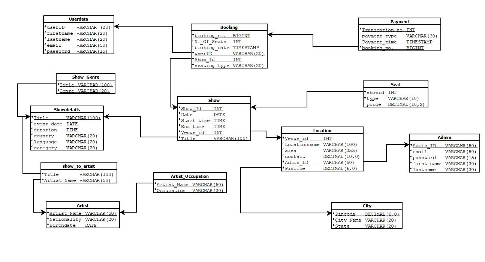

# EventHub - Event Booking Management System 🎪

A comprehensive Database Management System for managing event bookings including movies, theater plays, stand-up comedy shows, and concerts. **Built and optimized for PostgreSQL**.

## 📋 Project Overview

EventHub manages the complete event booking lifecycle - from user registration to payment processing. It handles artists, venues, shows, bookings, and revenue tracking across multiple cities. The entire system is designed and implemented using **PostgreSQL** with advanced database features.

## 🏗️ Database Design

### Entity Relationship Diagram


### Relational Schema


## 🗃️ Database Tables

**Core Tables**: userdata, artist, showdetails, admin, location, show, booking, payment  
**Supporting Tables**: artist_occupation, genre_link, show_to_artist, city, Seat

## 🎯 Key Features

- **Multi-city event management** across different venues
- **Flexible seating** with dynamic pricing (Premium, Standard, Economy)
- **Artist-show associations** with role definitions
- **Revenue tracking** and booking analytics
- **Admin-managed venues** with proper authorization
- **Secure payment processing** with transaction history

## 📊 Sample Analytics Queries

```sql
-- Top earning shows
SELECT s.title, SUM(b.no_of_seats*ss.price) AS revenue
FROM booking b
JOIN show s ON s.showid = b.showid
JOIN seat ss ON s.showid = ss.showid AND b.seating_type = ss.seating_type
GROUP BY s.title ORDER BY revenue DESC;

-- Most active users
SELECT u.firstname, u.lastname, COUNT(b.booking_no) AS total_bookings
FROM userdata u
JOIN booking b ON u.userid = b.userid
GROUP BY u.userid, u.firstname, u.lastname
ORDER BY total_bookings DESC;
```

## 🚀 Quick Setup

1. **Create Database Schema**
   ```sql
   CREATE SCHEMA Eventhub;
   SET SEARCH_PATH TO Eventhub;
   ```

2. **Run Scripts**
   ```bash
   # Create tables
   psql -f "DDL Scripts.txt"
   
   # Insert sample data
   psql -f "INSERT Scripts.txt"
   
   # Test queries
   psql -f "SQL Queries.txt"
   ```

## � Project Files

- `DDL Scripts.txt` - Database schema creation
- `INSERT Scripts.txt` - Sample data insertion  
- `SQL Queries.txt` - 21 analytical queries
- `ERD_Relational_Normalization.pdf` - Database design documentation

## 💡 Project Highlights

- **Database**: PostgreSQL with 11 normalized tables
- **Queries**: 21 complex analytical queries for business insights
- **Design**: 3NF normalization with proper referential integrity
- **Use Cases**: Real-world event booking scenarios

---
**A complete DBMS solution for efficient event management** ⭐
